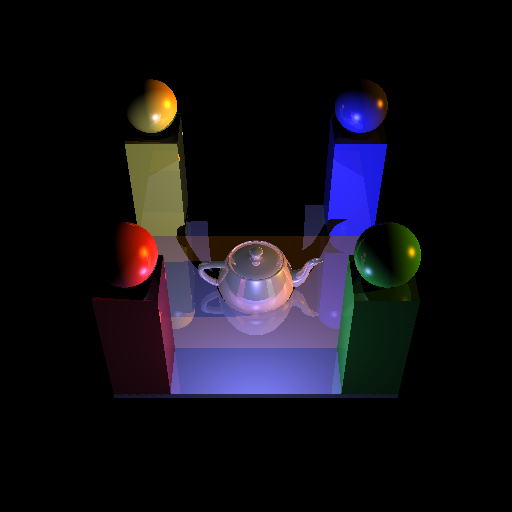

# Recursive Ray Tracer

   

Simple example of recursive ray tracer to render scenes offline. 

# Features 
* Phong shading as basic shading model 
* multithreaded rendering in CPU
* Three types of primitive objects are supported
    * Teapot 
    * Cube
    * Sphere
* Images are rendered to screen using [SDL](https://www.libsdl.org)

# Requirements
This project compiles with visual studio 2022 by default. If you need a different version of visual studio, feel free to change the content 
of the `scripts/win-genproject.bat` to match your visual studio version.

# Installation 
For now, the only supported platform is windows. To install: 
1. `git clone --recurse-submodules` this repository
2. Go to `recursive-ray-tracer/scripts`
3. Run `win-genproject.bat`. This command will generate a Visual Studio 2022 project you can open and compile.
4. Open the generated visual studio solution `RecRays.sln`
5. Set start up project as `rec_rays` if necessary
6. Specify path of scene to render as command line arguments. You can find a default scene in `rec_rays/scenes/test.txt`

